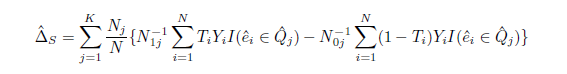

```{r setup, echo = FALSE,include=FALSE}
knitr::opts_chunk$set(echo = TRUE)
```

## Setup

First, we set working directories as needed, install required libraries and import the data. 

```{r wd, warning = FALSE, message = FALSE, echo = FALSE,include=FALSE}
#setwd("~/GitHub/Fall2020-Project4-group-4/doc")
setwd("~/Desktop/project4_5243/repo/doc")
```


```{r, warning = FALSE, message = FALSE, echo = FALSE, include=FALSE}
packages.used=as.list(
  c("data.table",
    "ggplot2",
    "dplyr",
    "rpart",
    "rpart.plot",
    "WeightedROC",
    "MatchIt",
    "optmatch",
    "lmtest",
    "sandwich",
    "Matching",
    "cobalt",
    "tidyverse",
    "glmnet")
)
check.pkg = function(x){
  if(!require(x, character.only=T)) install.packages(x, 
                                                     character.only=T,
                                                     dependence=T)
}
lapply(packages.used, check.pkg)
library(dplyr)
library(ggplot2)
library(WeightedROC)
library(rpart)
library(rpart.plot)
library(base)
library(MatchIt)
library(data.table)
library(optmatch)
library(lmtest)
library(sandwich)
library(Matching)
library(cobalt)
library(tidyverse)
library(glmnet)
```


```{r,include=FALSE}
#directory containing the data
data_dir <- "../data/" # This will be modified for different data sets.
highDim_csv <- paste(data_dir, "highDim_dataset.csv", sep="")
lowDim_csv <- paste(data_dir, "lowDim_dataset.csv", sep="")
#read csv
df_high <- read.csv(highDim_csv)
df_low <- read.csv(lowDim_csv)
```

## Introduction 

In this project, we are looking for the best algorithm for causal inference of propensity scores to see how close the estimated average treatment effects (ATEs) are to the true ATEs. For the estimation of propensity scores, we use regression trees. The algorithms we use to estimate ATEs in this project are propensity matching, stratification and weighted regression. We also compare the run times of different algorithms and propensity score estimations across both data sets.

## About the Data

There are two attached data sets for this project, named *highDim_data set* and *lowDim_data set*, which were from the Atlantic Causal Inference Conference (ACIC) Data Challenge. For the high dimensional data, there are 2000 observations, 185 variables ($V1$-$V185$), 1 treatment indicator variable ($A$) and 1 continuous response variable ($Y$). For the low dimensional data, there are 475 observations, 22 variables ($V1$-$V22$), 1 treatment indicator variable ($A$) and 1 continuous response variable ($Y$).

```{r, echo = FALSE}
# justification for using weights
print("High Dimensional Data")
prop.table(table(df_high$A))

print("Low Dimensional Data")
prop.table(table(df_low$A))
```

From the tables above, we see that the control groups are not balanced for both data sets. For the high dimension data, the treated group consists of 67.85% of the samples. For the low dimension data, the treated group consists of 78.8% of the samples. 

For the purpose of comparing the different algorithms, we chose to add weights to the observations while estimating the propensity scores using classification/regression trees.

## Background 

### Regression Trees

The mathematical formula for a regression tree is shown below.

$$\hat{f}(x) = \sum_{m = 1}^{M} c_{m}I\{x \in R_{m}\}$$

Here, $R_m$ is a specific region, $M$ is the number of regions, and $c_m$ is the value associated with a region. 

The way regression trees work is that the space is split into multiple regions based on some set of decisions. This process keeps repeating until a stopping rule is applied. In regression, we use **squared error loss** to find the optimal tree model, but in classification, as with the case for estimating propensity scores, we use a measure of impurity. In our case, we use one called the **Gini index**. In R, we use "rpart" library to run the regression tree algorithm. The parameters of the function includes **minsplit**, **minbucket** and **cp**. The parameter of **cp** indicates the complexity of the model, we get more complex trees with lower values of "cp". 

We can visualize the tree and the decision rules at each split, using the **plot.rpart** function in R. The decision rules help to determine which variables are of the highest importance when estimating the propensity scores. 


### Propensity Scores

The propensity score is defined as follows: 

$$e(x) = Pr(T = 1 | X = x), ~ 0 < e(x) < 1$$

Based on the formula above, given the (multiple) covariates ($x$), the propensity score is the probability that the observation is in the treatment group (in our case, observations where $A = 1$). Since, our data is based on observational studies, we can use propensity scores to make causal inferences. 

### Average Treatment Effect (ATE)

The average treatment effect is defined as follows: 

$$\Delta_{t} = E(Y_{1} - Y_{0} | T = 1)$$

ATE is defined as the difference in the average outcomes between observations assigned to treatment group and the control group. This allows us to measure the effect a treatment had on each group. 

## Cross-Validation

We perform five fold cross-validation for the high dimension and low dimension data sets. The main objective of the cross validation is to tune the "cp" parameter to avoid overfitting.

### Step 1: Set Controls and Establish Hyperparameters

We set up the controls to start the the cross validation process

```{r}
K <- 5  # number of CV folds
sample.reweight <- TRUE # run sample reweighting in model training

# setting the following to false loads data generated from a previous run
# this data is the same in each run due to a set seed

run.cv.trees_high <- FALSE # run cross-validation on the training set for trees on high dim data

run.cv.trees_low <- FALSE # run cross-validation on the training set for trees on low dim data
```

We choose a set of "cp" values here to cross validate in order to find the optimal "cp" value for each data set; here we choose to do powers of two. 

```{r}
# hyperparameters for trees
hyper_grid_trees <- expand.grid(
  maxdepth = c(1, 5, 10, 15, 20, 25, 30)
)
```

### Step 2: Cross-Validate the Hyperparameters

We source the library functions that we created to help cross validate the "cp" hyperparamter.

```{r loadlib_trees, echo=FALSE}
source("../lib/train_trees.R") 
source("../lib/test_trees.R")
source("../lib/cross_validation_trees.R")
```


```{r features}
# data pre-processing 

# features are the predictors: V1 - Vp
# column 1 is the response Y
# column 2 is the treatment A

feature_train_high = df_high[, -1:-2]
label_train_high = df_high[, 2]

feature_train_low = df_low[, -1:-2]
label_train_low = df_low[, 2]
```

#### High Dimensional Data

We run the cross validation algorithm on the high dimensional data.

```{r runcv_trees_high, message = FALSE }
set.seed(5243)

if(run.cv.trees_high){
  res_cv_trees_high <- matrix(0, nrow = nrow(hyper_grid_trees), ncol = 4)
  for(i in 1:nrow(hyper_grid_trees)){
    cat("complexity = ", hyper_grid_trees$cp[i], "\n", sep = "")
    res_cv_trees_high[i,] <- cv.function(features = feature_train_high, 
                                         labels = label_train_high,
                                         maxdepth = hyper_grid_trees$maxdepth[i], 
                                         K, reweight = sample.reweight)
  save(res_cv_trees_high, file = "../output/res_cv_trees_high.RData")
  }
} else{
  load("../output/res_cv_trees_high.RData")
}
```

#### Low Dimensional Data

We run the cross validation algorithm on the high dimensional data.

```{r runcv_trees_low, message = FALSE}
set.seed(5243)

if(run.cv.trees_low){
  res_cv_trees_low <- matrix(0, nrow = nrow(hyper_grid_trees), ncol = 4)
  for(i in 1:nrow(hyper_grid_trees)){
    cat("complexity = ", hyper_grid_trees$cp[i], "\n", sep = "")
    res_cv_trees_low[i,] <- cv.function(features = feature_train_low, 
                                        labels = label_train_low, 
                                        maxdepth = hyper_grid_trees$maxdepth[i], 
                                        K, reweight = sample.reweight)
  save(res_cv_trees_low, file="../output/res_cv_trees_low.RData")
  }
}else{
  load("../output/res_cv_trees_low.RData")
}
```

### Step 3: Visualize CV Error and AUC

After cross validating, we obtain the mean error and the AUC values for each potential "maxdepth" value for both data sets. We display these values and associated standard errors in the plots below. 

Because of the imbalances in the groups for both datasets, we choose to not only weigh our observations, but to also focus on mean AUC when selecting the optimal hyperparameter. 


#### High Dimensional Data 

Based on the plots and table below, we find that the model with the highest mean AUC value has a "maxdepth" value of $5$.

```{r}
# create data frame to organize results
res_cv_trees_high <- as.data.frame(res_cv_trees_high) 
colnames(res_cv_trees_high) <- c("mean_error", "sd_error", "mean_AUC", "sd_AUC")
cv_results_trees_high = data.frame(hyper_grid_trees, res_cv_trees_high)

# look at top 5 models with highest AUC
cv_results_trees_high[order(cv_results_trees_high$mean_AUC, decreasing = TRUE), ][1:5, ]
```

```{r, out.width = "85%", fig.align = 'center', echo=FALSE}
# cross validation results for high dimensional data: mean_error 
cv_results_trees_high %>% 
  ggplot(aes(x = as.factor(maxdepth), y = mean_error,
            ymin = mean_error - sd_error, 
            ymax = mean_error + sd_error)) + 
  labs(title="Mean of Error with Different Maxdepth Values for High Dimensional Data ",
       x="maxdepth", y = "Mean of Error") +
  geom_crossbar() + theme(axis.text.x = element_text(angle = 90, hjust = 1))

# cross validation results for high dimensional data: mean_AUC
cv_results_trees_high %>% 
  ggplot(aes(x = as.factor(maxdepth), y = mean_AUC,
             ymin = mean_AUC - sd_AUC, ymax = mean_AUC + sd_AUC)) + 
  labs(title="Mean of AUC with Different Maxdepth Values for High Dimensional Data ",
       x="maxdepth", y = "Mean of AUC")+
  geom_crossbar() + theme(axis.text.x = element_text(angle = 90, hjust = 1))
```

```{r}
best_maxdepth_high <- cv_results_trees_high$maxdepth[cv_results_trees_high$mean_AUC ==
                                           max(cv_results_trees_high$mean_AUC)]

best_maxdepth_high
```

#### Low Dimensional Data 

Based on the plots and table below, we find that the model with the highest mean AUC value has a "maxdepth" value of $25$.

```{r}
# create data frame to organize results
res_cv_trees_low <- as.data.frame(res_cv_trees_low) 
colnames(res_cv_trees_low) <- c("mean_error", "sd_error", "mean_AUC", "sd_AUC")
cv_results_trees_low = data.frame(hyper_grid_trees, res_cv_trees_low)

# look at top 5 models with lowest AUC
cv_results_trees_low[order(cv_results_trees_low$mean_AUC, decreasing = TRUE), ][1:5, ]
```

```{r, out.width = "85%", fig.align = 'center', echo=FALSE}
cv_results_trees_low %>%
  ggplot(aes(x = as.factor(maxdepth), y = mean_error,
            ymin = mean_error - sd_error, 
            ymax = mean_error + sd_error)) + 
  labs(title="Mean of Error with Different Maxdepth Values for Low Dimensional Data ",
       x="maxdepth", y = "Mean of Error")+
  geom_crossbar() + theme(axis.text.x = element_text(angle = 90, hjust = 1))

# cross validation results for low dimensional data: mean_AUC
cv_results_trees_low %>% 
  ggplot(aes(x = as.factor(maxdepth), y = mean_AUC,
             ymin = mean_AUC - sd_AUC, ymax = mean_AUC + sd_AUC)) + 
  labs(title="Mean of AUC with Different Maxdepth Values for Low Dimensional Data ",
       x="maxdepth", y = "Mean of AUC")+
  geom_crossbar() + theme(axis.text.x = element_text(angle = 90, hjust = 1))
```


```{r}
best_maxdepth_low <- cv_results_trees_low$maxdepth[cv_results_trees_low$mean_AUC ==
                                           max(cv_results_trees_low$mean_AUC)]
best_maxdepth_low
```

## Propensity Score Estimation

With the optimal "cp" parameters for each dataset, we now estimate the propensity scores using a weighted classification tree model. 

```{r weights}
# imbalanced dataset requires weights 
# to be used in the trained model

weights_high <- rep(NA, length(df_high$A))
for (v in unique(df_high$A)){
  weights_high[df_high$A == v] = 0.5 * length(df_high$A) / length(df_high$A[df_high$A == v])
}


weights_low <- rep(NA, length(df_low$A))
for (v in unique(df_low$A)){
  weights_low[df_low$A == v] = 0.5 * length(df_low$A) / length(df_low$A[df_low$A == v])
}
```

#### High Dimensional Data 

```{r}
start.time_propensity_score_high <- Sys.time()

# create tree model for high dimensional data with best cp parameter
tree_high <- rpart(A ~ . - Y, method = "class", data = df_high, maxdepth = best_maxdepth_high)

# calculate propensity scores
prop_score_high <- predict(tree_high, newdata = df_high[, -2], type = "prob")[, 2]

end.time_propensity_score_high <- Sys.time()
time_propensity_score_high <- end.time_propensity_score_high - start.time_propensity_score_high
time_propensity_score_high
```

```{r, out.width = "85%", fig.align = 'center', echo=FALSE}
# plot tree
rpart.plot(tree_high, type = 1, digits = 3, fallen.leaves = TRUE)
```

#### Low Dimensional Data

```{r}
start.time_propensity_score_low <- Sys.time()

# create tree model for low dimensional data with best cp parameter
tree_low <- rpart(A ~ . - Y, method = "class", data = df_low, maxdepth = best_maxdepth_low)

# calculate propensity scores
prop_score_low <- predict(tree_low, newdata = df_low[, -2], type = "prob")[, 2]

end.time_propensity_score_low <- Sys.time()
time_propensity_score_low <- end.time_propensity_score_low - start.time_propensity_score_low
time_propensity_score_low
```

```{r, out.width = "85%", fig.align = 'center', echo=FALSE}
# plot tree
rpart.plot(tree_low, type = 1, digits = 3, fallen.leaves = TRUE)
```

## ATE Estimation

With the estimated propensity scores on hand, we propose, explain, and discuss the pros and cons of three different ATE estimation algorithms: propensity matching, stratificationand weighted regression. 

### Stratification

In the stratification method, we aim at dividing the data set into strata such that the propensity scores in each stratum are close enough. For choosing number of strata, $K$, five ($5$) was advocated by Rosenbaum and Rubin (1984). However, the propensity scores generated by CART are discrete numbers that are not proportional to the quantiles. If we divide the data into five strata by quantiles, each having roughly 20% of the total number of objects, the propensity scores in each stratum might not be similar.

```{r include=FALSE}
#propensity score by quantiles for low dimensional data set
Quantile_data <- as.double(seq(0.2, 100, 0.2))
Propensity_Score_low <- sort(g.matches_low$prop_score)
prop_low <- data.frame(cbind(Quantile_data, Propensity_Score_low)) 
g1 <- ggplot(prop_low, mapping = aes(x = Quantile_data, y = Propensity_Score_low)) +
  geom_point()
g1

#propensity score by quantiles for high dimensional data set
Quantile_data <- as.double(seq(0.05, 100, 0.05))
Propensity_Score_high <- sort(g.matches_high$prop_score)
prop_high <- data.frame(cbind(Quantile_data, Propensity_Score_high)) 
g2 <- ggplot(prop_high, mapping = aes(x = Quantile_data, y = Propensity_Score_high)) +
  geom_point()
g2
```
Therefore, we divided the low dimensional data set into 6 stratum, and the high dimensional data set into 2 stratum, where propensity score in each strata is either uniform or sighnificantly close.

The following formula was used to calculate the ATE:



where $K$ is the number of strata, $\hat{e}$ is the estimated propensity score, $Y$ is the response for each observation, and $T$ is the treatment variable (either $0$ or $1$). $N_j$ is the number of individuals in stratum $j$. $N_{1j}$ is the number of “treated” individuals in stratum $j$, while $N_{0j}$ is the number of “controlled” individuals in stratum $j$. $\hat{Q_j} = (\hat{q_{j-1}}, \hat{q_j}]$ where $\hat{q_j}$ is the $j$th sample quantile of the estimated propensity scores.

#### Low Dimensional Data 

```{r}
prop_score <- g.matches_low$prop_score
df_low <- cbind(df_low, prop_score)
df_strat_low <- df_low %>%
  select(Y, A, prop_score)
strata_low_1 <- df_strat_low[df_strat_low$prop_score <= 0.125, ]
sum_strata_low_1 <- strata_low_1 %>%
  group_by(A) %>%
  summarise(Avg_Y = mean(Y))
strata_low_2 <- df_strat_low[0.125 < df_strat_low$prop_score & df_strat_low$prop_score <= 0.250, ]
sum_strata_low_2 <- strata_low_2 %>%
  group_by(A) %>%
  summarise(Avg_Y = mean(Y))
strata_low_3 <- df_strat_low[0.250 < df_strat_low$prop_score & df_strat_low$prop_score <= 0.5, ]
sum_strata_low_3 <- strata_low_3 %>%
  group_by(A) %>%
  summarise(Avg_Y = mean(Y))
strata_low_4 <- df_strat_low[0.5 < df_strat_low$prop_score & df_strat_low$prop_score <= 0.75, ]
sum_strata_low_4 <- strata_low_4 %>%
  group_by(A) %>%
  summarise(Avg_Y = mean(Y))
strata_low_5 <- df_strat_low[0.75 < df_strat_low$prop_score & df_strat_low$prop_score <= 0.875, ]
sum_strata_low_5 <- strata_low_5 %>%
  group_by(A) %>%
  summarise(Avg_Y = mean(Y))
strata_low_6 <- df_strat_low[0.875 < df_strat_low$prop_score, ]
sum_strata_low_6 <- strata_low_6 %>%
  group_by(A) %>%
  summarise(Avg_Y = mean(Y))

ATE_Stratification_low <- as.double(((sum_strata_low_1[2,2] - sum_strata_low_1[1,2])*nrow(strata_low_1) + (sum_strata_low_2[2,2] - sum_strata_low_2[1,2])*nrow(strata_low_2) +
(sum_strata_low_3[2,2] - sum_strata_low_3[1,2])*nrow(strata_low_3) +
(sum_strata_low_4[2,2] - sum_strata_low_4[1,2])*nrow(strata_low_4) +
(sum_strata_low_5[2,2] - sum_strata_low_5[1,2])*nrow(strata_low_5) +
(sum_strata_low_6[1,2])*nrow(strata_low_6))/nrow(df_strat_low))
ATE_Stratification_low
```
The ATE of low dimensional data calculated by stratification is 4.388841.


#### High Dimensional Data 

```{r}
prop_score <- g.matches_high$prop_score
df_high <- cbind(df_high, prop_score)
df_strat_high <- df_high %>%
  select(Y, A, prop_score)
strata_high_1 <- df_strat_high[df_strat_high$prop_score <= 0.3, ]
sum_strata_high_1 <- strata_high_1 %>%
  group_by(A) %>%
  summarise(Avg_Y = mean(Y))
strata_high_2 <- df_strat_high[0.3 < df_strat_high$prop_score, ]
sum_strata_high_2 <- strata_high_2 %>%
  group_by(A) %>%
  summarise(Avg_Y = mean(Y))

ATE_Stratification_high <- as.double(((sum_strata_high_1[2,2] - sum_strata_high_1[1,2])*nrow(strata_high_1) + (sum_strata_high_2[2,2] - sum_strata_high_2[1,2])*nrow(strata_high_2)) /nrow(df_high))
ATE_Stratification_high
```
The ATE of low dimensional data calculated by stratification is -61.93289.


### Propensity Matching using Propensity Score from Regression Trees (Full Matching)

Full matching creates a series of matched sets, where each matched set contains at least one treated individual
and at least one control individual (and each matched set may have many from either group). Full matching
forms these matched sets in an optimal way, such that treated individuals who have many comparison
individuals who are similar (on the basis of the propensity score) will be grouped with many comparison
individuals, whereas treated individuals with few similar comparison individuals will be grouped with relatively
fewer comparison individuals.(See Stuart (2010))

Our group is assigned the task of using propensity score for Full Matching. The distance of Propensity Score is defined as:
$$D_{ij}=\mid e_{i}-e_{j} \mid$$
where $e_{k}$ is the propensity score for individual $k$.

After the matched sets are obtained, calculate a “subclass effects” for each matched set/subclass, and then
estimate overall ATE by an weighted average of the subclass effects where weights would be the number of
individuals in each subclass.


#### Getting the Data Loaded for High and Low Dimension Data
```{r}
source("../lib/propensity_matching.R")
match_High_Dim <- get_match_obj(read.csv(highDim_csv), prop_score_high)
match_Low_Dim <- get_match_obj(read.csv(lowDim_csv), prop_low_high)

# creates a dataset with one row per unit. It will be identical to the dataset supplied except 
# that several new columns will be added containing information related to the matching
g.matches_high <- match.data(match_High_Dim, data = read.csv(highDim_csv), distance = "prop_score")
g.matches_low <- match.data(match_Low_Dim, data = read.csv(lowDim_csv), distance = "prop_score")
```


###Estimating Effects After Matching

We diagnose the quality of the resulting matched samples.
We would would like the treatment to be unrelated to the covariates such that:
$$\tilde{p}(X|T=1)=\tilde{p}(X|T=0)$$
where $\tilde{p}$ denotes the empirical distribution.


A plot of the standardized differences of means, gives us a quick overview of
whether balance has improved for individual covariates.

###Standardized Differences of Means After Matching Low Dimensional Data
```{r}
love.plot(match_Low_Dim,stats = c("mean.diffs", "variance.ratios"), binary = "std",drop.distance = TRUE, 
          var.order = "unadjusted",
          abs = TRUE,
          thresholds = c(m = .2, v = 2))

love.plot(match_Low_Dim,stats = c("mean.diffs", "variance.ratios"), binary = "std",drop.distance = TRUE, 
          var.order = "unadjusted",
          abs = FALSE,
          thresholds = c(m = .2, v = 2))
```
From these plots we see that balance was quite poor prior to matching, but full matching improved balance on all covariates

###Standardized Differences of Means After Matching High Dimensional Data
```{r}
list1 <- seq(1, 200, by=1)
empty_vec <- rep("", 200)

#empty_vec=vector(length =  200, " ")
list1=paste0("V",list1)


v <- data.frame(old = list1,
                new = empty_vec)


love.plot(match_High_Dim, binary = "std",drop.distance = TRUE, 
          var.order = "unadjusted",
          abs = TRUE,
          thresholds = c(m = .25), var.names = v) #line = TRUE
```
the standardized difference of means of each covariate has decreased after matching.


For continuous covariates, we can also examine quantile–quantile (QQ) plots, which compare the empirical distributions of each variable.
QQ plots compare the quantiles of a variable in the treatment group against the corresponding quantiles in the control group. If the two groups have identical empirical distributions, all points would lie on the 45 degree line.
###eQQ Low Dimensional Data
```{r}
#eQQ plot
plot(match_Low_Dim, type = "qq", interactive = FALSE)
```

###eQQ High Dimensional Data
```{r}
#eQQ plot
plot(match_High_Dim, type = "qq", interactive = FALSE, which.xs = c("V176","V172", "V169", "V166", "V164", "V157"))
```
The y-axis displays the value of the covariate for the treated units, and the x-axis displays the the value of the covariate at the corresponding quantile in the control group. When values fall on the 45 degree line, the groups are balanced.
We can see that some covariates remain somewhat imbalanced, but other covariates have much better balance after matching than before.


Statistics related to the difference in the empirical cumulative density functions (eCDFs) of each covariate between groups allow assessment of imbalance across the entire covariate distribution of that covariate rather than just its mean or variance.

###eCDFs Low Dimensional Data
```{r}
plot(match_Low_Dim, type = "ecdf", interactive = FALSE)
```


###eCDFs High Dimensional Data
```{r}
plot(match_High_Dim, type = "ecdf", interactive = FALSE, which.xs = c("V103","V121","V131","V138","V137","V136","V139", "V140", "V141", "V141"))
```
The x-axis display the covariate values and the y-axis display the proportion of the sample at or less than that covariate value. Perfectly overlapping lines indicate good balance. The black line corresponds to the treated group and the gray line to the control group.

We see adequate overlap of the propensity scores, with a good control match for each treated individual. For weighting or
subclassification, plots such as the ones below show the dots with their size proportional to their weight.
###Distribution of Propensity Scores High Dimensional Data
```{r}
plot(match_High_Dim, type = "jitter", interactive = FALSE)
```
###Distribution of Propensity Scores Low Dimensional Data
```{r}
plot(match_Low_Dim, type = "jitter", interactive = FALSE)
```

###Calculating the ATE after Full matching

Including interactions between the treatment and covariates can be beneficial when effect modification by the covariates may be present.
In order to interpret the coefficient on treatment as a marginal effect estimate, we need to center the covariates at their means in the target population.
Below we use the strategy of centering the covariates at their means.
```{r}

md_cen <- g.matches_high
ATE_fullmatching_high_fit <- get_ATE_using_treatment_covariate_interactions(g.matches_high,185)

#Only output the intercept and coefficient on treatment
result_ATE_high<-coeftest(ATE_fullmatching_high_fit, vcov. = vcovCL, cluster = ~subclass)[1:2,]


ATE_fullmatching_high <- result_ATE_high[2][1]
ATE_fullmatching_high
```


```{r}
md_cen <- g.matches_low
ATE_fullmatching_low_fit <- get_ATE_using_treatment_covariate_interactions(g.matches_low,22)

#Only output the intercept and coefficient on treatment
result_ATE_low<-coeftest(ATE_fullmatching_low_fit, vcov. = vcovCL, cluster = ~subclass)[1:2,]

ATE_fullmatching_low <- result_ATE_low[2][1]
ATE_fullmatching_low
```


### Weighted Regression
Weighted least square estimation of the regression function:
$$Y_{i} = \alpha_{0}+\tau*T_{i}+\alpha_{1}^{'}*Z_{i}+\alpha_{2}^{'}*(Z_{i}-\bar{Z})*T_{i}+\varepsilon _{i}$$

The weights are the same as the ones of “Inverse Propensity Weighting”. The $Z_{i}$ are a subset of the covariates $X_{i}$; with sample average $\bar{Z}$. $\tau$ is an estimate for ATE.
For the method of selecting Z, we get the estimation using linear regressions:
$$Y_{i}=\beta_{k0}+\beta_{k1}*T_{i}+\beta_{k2}*X_{ik}+\varepsilon_{i}$$
We calculate the t-statistic for the test of the null hypothesis that the slope coefficient $\beta_{k2}$ is equal to zero in each of these regressions, and now select for $Z$ all the covariates with a t-statistic larger in absolute value than $t_{reg}$. Thus, we include in the final regression all covariates which have substantial correlation with the outcome conditional on the treatment. (See Hirano and Imbens (2001))


#### Loading the Data and Data Preprocessing

```{r , include=FALSE}
df_low$A <- as.factor(df_low$A)
df_high$A <- as.factor(df_high$A)
```

```{r}
set.seed(0)
X_low <- df_low %>% select(-Y, -A) %>% as.matrix
A_low <- df_low %>% select(A) %>% as.matrix
```

```{r}
X_high <- df_high %>% select(-Y, -A) %>% as.matrix
A_high <- df_high %>% select(A) %>% as.matrix
```

#### Finding weights
```{r}
#The weight will be used for the weighted least square estimation of the regression function. (formula 1)

weight_low <- cbind(as.numeric(A_low), prop_score_low) %>% 
  as_tibble %>%
  mutate(weights = (V1/prop_score_low + (1-V1)/(1-prop_score_low))) %>%
  select(weights)
weight_high <- cbind(as.numeric(A_high), prop_score_low) %>% 
  as_tibble %>%
  mutate(weights = (V1/prop_score_high + (1-V1)/(1-prop_score_high))) %>%
  select(weights)
```


#### Linear regression for selecting covarites
```{r}
#Calculate the t-statistic
#we select for Z all the covariates with t-statsitic larger in absolute value than t reg (formula 2)

filter_low <- summary(lm(Y~., data = df_low))$coef[,4][3:24]<0.05
Z_low <- cbind(A_low, X_low[,filter_low])
```

```{r}
filter_high <- summary(lm(Y~., data = df_high))$coef[,4][3:ncol(X_high)]<0.05
Z_high <- cbind(A_high, X_high[,filter_high])
```

#### Modify the data
```{r}
Z_low <- Z_low %>% apply(2, as.numeric)
Z_high <- Z_high %>% apply(2, as.numeric)
```

#### Final Regression for ATE
```{r}
Y_low <- df_low$Y
Y_high <- df_high$Y
```

```{r}
#fit the weighted regression model and pick the coefficient of the treatment since ATE is the coeff of the treatment Ti (formula 1)
weighted_low <- lm(Y_low ~ Z_low, weights = as.numeric(unlist(weight_low)))
ATE_weightedreg_low <- coef(weighted_low)[2]
```

```{r}
weighted_high <- lm(Y_high ~ Z_high, weights = as.numeric(unlist(weight_high)))
ATE_weightedreg_high <- coef(weighted_high)[2]
```


#### Summarizing Final Results
```{r}
ATE_weightedreg_low
ATE_weightedreg_high
```


## Results 

We compare the accuracy and performance of the three ATE Estimation procedures below. 

### ATE Results

We are provided the true ATE values of $-54.8558$ for the high dimensional data and $2.0901$ for the low dimensional data. 

```{r, echo = FALSE}
# summarize table of results - ATE
# ATE_true_high <- -54.8558
# ATE_true_low <- 2.0901
# ATE <- matrix(c(ATE_true_high, ATE_stratification_high, 
#                 ATE__high, 
#                 ATE_weightedreg_high, 
#                 ATE_true_low, 
#                 ATE_stratification_low, 
#                 ATE_regression_adjustment_low, 
#                 ATE_weightedreg_low), 
#               ncol = 2, byrow = F)
# 
# colnames(ATE) <- c("High Dimensional Data", "Low Dimensional Data")
# 
# rownames(ATE) <- c("True", "Stratification", "Regression Adjustment",
#                    "Weighted Regression")
# 
# ATE <- as.table(ATE)
# 
# ATE
```

From the table above, we see that regression adjustment performed the best for the high dimensional data and stratification performed the best for the low dimensional data. 

### Run Time Results

```{r, echo = FALSE}
# summarize table of results - Run Time
# time <- matrix(c(time_propensity_score_high, 
#                  time_stratification_high, 
#                  time_regression_adjustment_high, 
#                  time_stratification_regression_adjustment_high, 
#                  time_propensity_score_low, 
#                  time_stratification_low, 
#                  time_regression_adjustment_low, 
#                  time_stratification_regression_adjustment_low), 
#                ncol = 2, byrow = F)
# 
# colnames(time) <- c("High Dimensional Data", "Low Dimensional Data")
# 
# rownames(time) <- c("Propensity Score Estimation", "Stratification", 
#                     "Regression Adjustment",
#                     "Stratification + Regression Adjustment")
# 
# time <- as.table(time)
# 
# time
```

Given the nature of trees, propensity score estimations are quickly calculated once we have the proper hyperparamters selected from cross-validation--even for the high dimensional data, propensity score estimations did not take more than two seconds. 

It is also no surprise that, given the sizes of our two datasets, that regression adjustment was the fastest method. However, with larger datasets with more observations, this may not be the case. Stratification took the longest time, mainly due to the many intermediate calculations requited. Lastly, the combination method of both stratification and regression adjustment had a run time between the two former methods. 

However, we want to note that this .Rmd file was knitted using a computer with a NVMe SAMSUNG SSD with 16 GB RAM. Run times may vary from device to device and with each iteration. Descriptions of run times are based on average run times we saw through numerous iterations. 

## Conclusion 

Overall, we believe that using classification/regression trees for propensity scores was not the ideal approach for either dataset. While we cross-validated the complexity hyperparameter, cp, to help avoid with overfitting, our models for both the high dimensional and low dimensional datasets ended up estimating the same propensity score value for over half of the entire dataset. This would not be a very helpful model in differentiating our observations and of course affect our ATE estimations regardless of the method used. 

We see this most prominently in stratification, in which different values of $K$, that is, the number of strata, resulted in an empty stratum in our results. Even after choosing a value of $K$ which would present no empty strata, we saw that each stratum tend to have imbalanced classes. In the case of the low dimensional dataset, one stratum only consisted of observations from the control group. These complications may explain why the stratification plus regression adjustment method would not have performed the best. 

However, the results were relatively consistent among all three methods--there were no large deviations from the true value. In particular, the ATE for stratification was actually quite close to the true value for the low dimensional data. Additionally, compared to other methods, we note the relative ease of interpretation and fast run times for not only the propensity score estimations but also for the ATE estimations as well. While we may not advocate for these estimation methods for their accuracy (and validity in certain cases), but these methods here show a fast and easy way to get a general sense of the average treatment effect. 

## References 

  * Atkinson, Beth. “Recursive Partitioning And Regression Trees.” R Documentation, DataCamp, www.rdocumentation.org/packages/rpart/versions/4.1-15/topics/rpart. 
  
  * Austin, Peter C. 2011. “An Introduction to Propensity Score Methods for Reducing the Effects of Confounding in Observational Studies.” Multivariate Behavioral Research 46 (3): 399–424.

 * Chan, David & Ge, Rong & Gershony, Ori & Hesterberg, Tim & Lambert, Diane. (2010). Evaluating online ad campaigns in a pipeline: Causal models at scale. Proceedings of the ACM SIGKDD International Conference on Knowledge Discovery and Data Mining. 7-16. 10.1145/1835804.1835809. 

 * D'Agostino RB Jr. Propensity score methods for bias reduction in the comparison of a treatment to a non-randomized control group. Stat Med. 1998 Oct 15;17(19):2265-81. doi: 10.1002/(sici)1097-0258(19981015)17:19<2265::aid-sim918>3.0.co;2-b. PMID: 9802183.

 * Hastie, Trevor,, Robert Tibshirani, and J. H Friedman. The Elements of Statistical Learning: Data Mining, Inference, and Prediction. 2nd ed. New York: Springer, 2009. Print.

 * Lunceford, Jared K, and Marie Davidian. 2004. “Stratification and Weighting via the Propensity Score in Estimation of Causal Treatment Effects a Comparative Study.” Statistics in Medicine 23 (19): 2937–60.
 
 * Rosenbaum PR, Rubin DB. The central role of the propensity score in observational studies for causal efiects.Biometrika 1983; 70:41–55.
